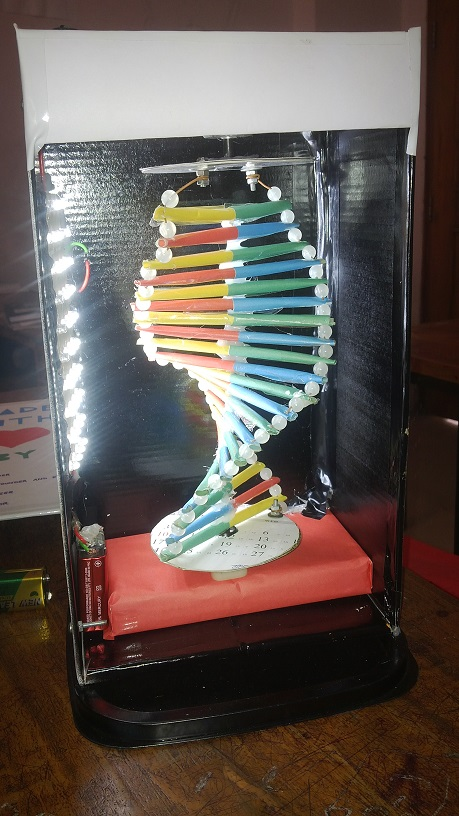

## Responsive DNA

As the title suggests, this is an animated illustration of the DNA helix loop made with CSS.

The infinite double-helix loop is created by adding a slight delay on every div element in the DNA container. The deoxyribose sugar is painted in white as two circles. Also, nitrogenous bases are shown as colored lines that join the sugar circles.

  

It is not a standard replication of actual DNA. It's a minimal instance of DNA made with HTML (pug) and CSS. Didn't bother about responsiveness as viewport units already nailed it!

How I got the idea? Well, my classmates and I did a practical project on it when we were in high school. Inspiration comes from there!

	
	
	

I already did a [similar concept](https://codepen.io/shadow-scientist/pen/wvWmPEL) with JavaScript in 2020. Found that the code was horrible!

You can find a [quick demo](https://codepen.io/shadow-scientist/pen/eYgPjxX) of it on CodePen and the [tweet](https://twitter.com/ShadowShahriar/status/1385092310052970507/) here. If you're interested in CSS and a hell of projects like this, you're always welcome to follow along my journey.

